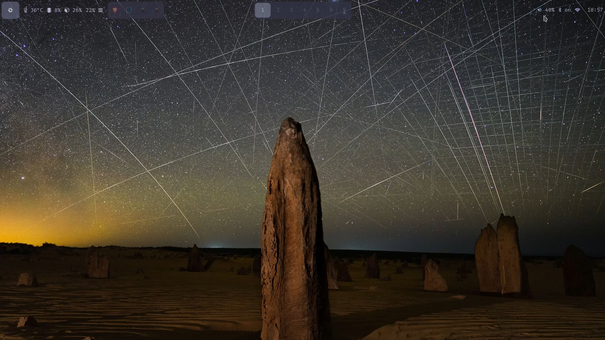

# dotfiles
dotfiles for my Hyprland desktop setup on NixOS. 

# Usage
See dependencies and more information in [my monolithic configuration.nix NixOS file](https://github.com/socd06/nixos-configuration).
They should work on their own on arch with some tweaking. 
I may convert or archive this repo when/if I transition to a home manager configuration.
Use at own risk. 

# Preview

# Video demo
See [this video](https://www.youtube.com/watch?v=EdACCAFVvKo&t=2s)
